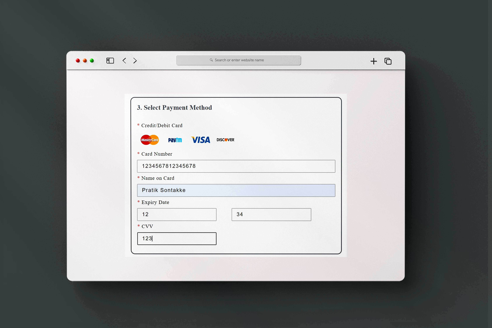
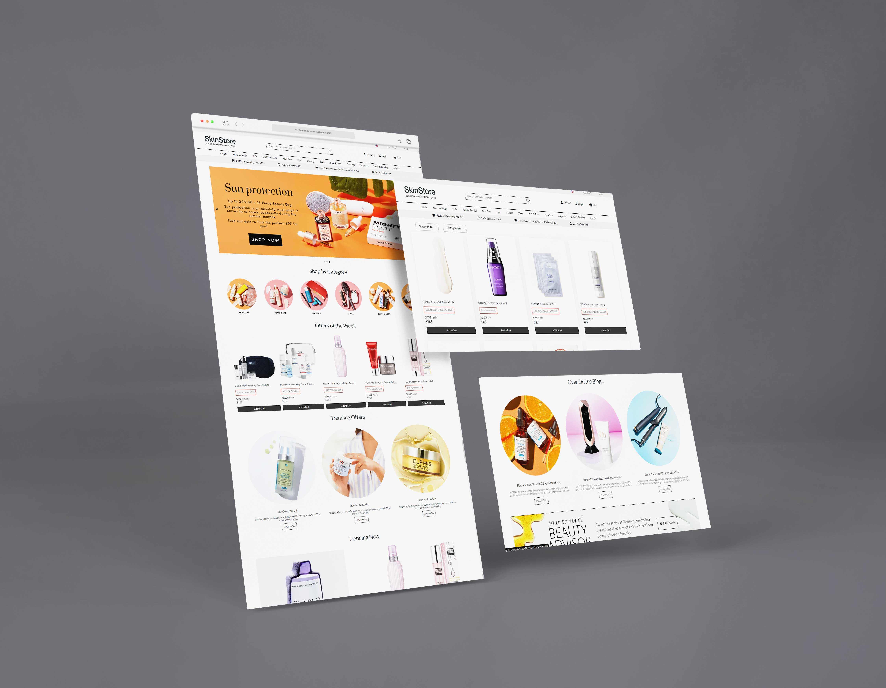
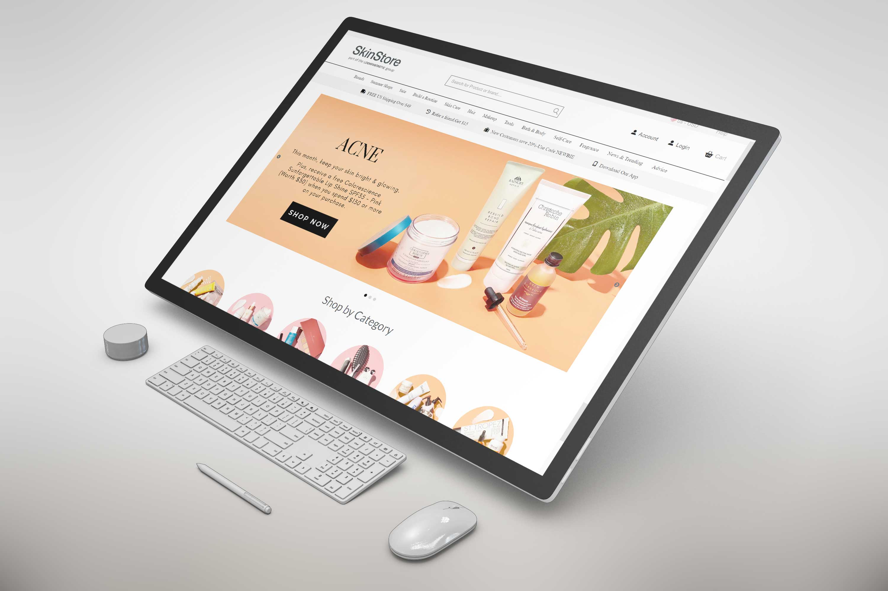
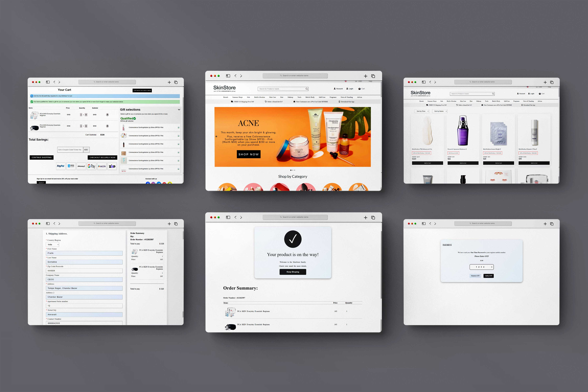

# SkinStore clone 

SkinStore is an authorized retailer to 100s of premium beauty brands across skin, makeup and hair including SkinCeuticals, Dermalogica, Caudalie etc.

## Deployed link of project
- <a href="https://exquisite-hotteok-e396d1.netlify.app/index.html">skinstore.com (Clone)</a>

## Team Members

<ul>
  <li><a href="https://github.com/pratiksontakke">Pratik Sontakke</a></li>
  <li><a href="https://github.com/NarendraKumarSwami">Narendra Kumar Swami</a></li>
  <li><a href="https://github.com/pushpam-386">Pushpam Kumar</a></li>
  <li><a href="https://github.com/apeksham6">Apeksha Motghare</a></li>
  <li><a href="https://github.com/ayskant123">Ayskant Mishra</a></li>
</ul>


## Deployment

On frontend terminal perform:

```bash
  Open index.html with live server
```


## 🛠 Tech Stack

- Boothstrap
- Material UI
- Javascript
- HTML
- CSS
- Local storage

## Functionality

- Login/Signup
- Authentication
- User can add and delete product
- Add to cart
- Payment Page with Discount Functionality
- Checkout

## Website flow for User

- Home page

- Category wise products

- Product page(List of all products)

- Cart page

- Address page

- Payment page , One Time Password verification page.

- Login navbar section.
    - My Account Page.
    - My Setting Page.
    - Sign up Page.
    - Login Page.
    

#### On address page use promo code - masai15

- you will  get 30% discount (Coupon Code - **Masai30**)


#### Hard Coded Card details for payment section

###### Payment OTP = 1234



#### Website Presentation :






## Thank you note
Thank you all who is giving precious time to visit our little creative project which is made with lot of efforts.

_<p align="center"><sub>- Readme file designed by <a href="https://github.com/pratiksontakke">Pratik Sontakke</a> -</sub></p>_